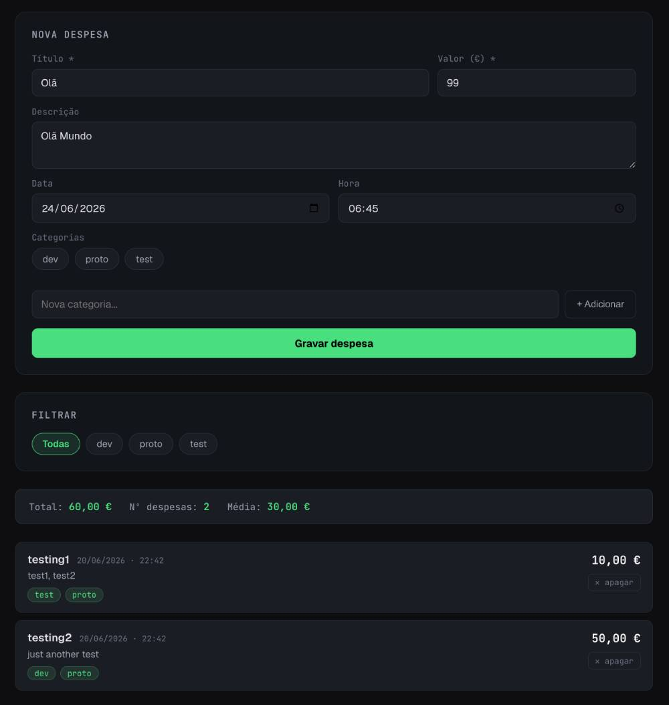

# Expenses Tracker



Single-page expenses tracker. 
Self-hosted, responsive UI (in Portuguese).
Stored as JSON file, CSV export.
Stdlib-only Python backend, one HTML/CSS/JS frontend. No build system, no dependencies. 

## Run

```bash
python3 app.py
```

Open `http://localhost:8020`.

## Data

Stored as flat JSON files in the project folder:

- `expenses.json` — list of expenses (title, description, date, time, amount, categories)
- `categories.json` — list of category names

Back up by copying these two files.

## API

| Method | Path | Purpose |
|---|---|---|
| GET | `/` | serves the app |
| GET | `/api/expenses?category=` | list expenses, optional category filter |
| POST | `/api/expenses` | add expense |
| DELETE | `/api/expenses/<id>` | remove expense |
| GET | `/api/categories` | list categories |
| POST | `/api/categories` | add category |
| GET | `/api/export/csv?category=` | export CSV |
